<div align="center">


<h1>Cross-Cloud DR Patterns</h1>

<p><strong>The Institutional-Grade Platform for Standardized Resilience Foundations, Failover Governance, and Multi-Cloud Continuity Ecosystems.</strong></p>

[]()
[]()
[]()

<br/>

> **"Industrializing global resilience to automate failover foundations."** 
> **Cross-Cloud DR Patterns** is an enterprise-grade platform designed to provide a secure, measurable, and highly automated foundation for global disaster recovery operations. It orchestrates the complex lifecycle of multi-cloud resilience—from real-time health monitoring and automated traffic steering to high-throughput data replication and unified resilience auditing.

</div>

---

## 🏛️ Executive Summary

Single-cloud reliance and manual disaster recovery orchestration are strategic operational liabilities; lack of a standardized cross-cloud resilience pattern is a primary barrier to organizational engineering maturity. Organizations fail to maintain uptime not because of a lack of backups, but because of fragmented failover standards, lack of automated drill validation, and an inability to orchestrate resilience planes with operational precision.

This platform provides the **Resilience Intelligence Plane**. It implements a complete **Cross-Cloud-DR-as-Code Framework**, enabling CIOs and SRE teams to manage global resilience foundations as first-class citizens. By automating the identification of availability bottlenecks through real-time telemetry analysis and orchestrating the provisioning of secure performance-driven resilience policies, we ensure that every organizational application—from mission-critical payment gateways to distributed analytics engines—is resilient by default, audited for history, and strictly aligned with institutional resilience frameworks.

---

## 📐 Architecture Storytelling: Principal Reference Models

### 1. Principal Architecture: Global Cross-Cloud DR & Resilience Intelligence Plane
This diagram illustrates the end-to-end flow from resilience telemetry ingestion and multi-cloud orchestration to failover enforcement, performance validation, and institutional resilience auditing.

```mermaid
graph LR
    %% Subgraph Definitions
    subgraph ResilienceIngress["Health & Replication Ingress"]
        direction TB
        Active_Traffic["Active-Active Global Traffic"]
        Data_Replication["Logical / Block Replication"]
        Health_Probes["Synthetic / Resource Probes"]
    end

    subgraph IntelligenceEngine["Resilience Intelligence Hub"]
        direction TB
        API["FastAPI Resilience Gateway"]
        FailoverOrchestrator["Global Failover & Drill Hub"]
        Governance_Hub["Compliance & Guardrail Hub"]
        AIOps_Validator["Drift & Availability Analysis Hub"]
    end

    subgraph OperationsPlane["Distributed Resilience Ecosystem"]
        direction TB
        ManagedResilienceNodes["Managed Standardized Standby Nodes"]
        ActiveRunbooks["Managed Automated DR Runbooks"]
        SteeringSinks["Managed Infrastructure Steering Hubs"]
    end

    subgraph OperationsHub["Institutional Data Hub"]
        direction TB
        Scorecard["Resilience Maturity Scorecard"]
        Analytics["Failover Flow & RTO/RPO Velocity Stats"]
        Audit["Forensic Resilience Metadata Lake"]
    end

    subgraph DevOps["Cross-Cloud-DR-as-Code Framework"]
        direction TB
        TF["Terraform Resilience Modules"]
        DriftBot["Productivity & Config Drift Validator"]
        ChatOps["Measurement Operations Hub"]
    end

    %% Flow Arrows
    ResilienceIngress -->|1. Submit Telemetry| API
    API -->|2. Orchestrate Resilience| FailoverOrchestrator
    FailoverOrchestrator -->|3. Apply Privacy Guard| Governance_Hub
    Governance_Hub -->|4. Assess Drift| AIOps_Validator
    
    AIOps_Validator -->|5. Execute Failover| OperationsPlane
    OperationsPlane -->|6. Notify Status| ChatOps
    API -->|7. Visualize Health| Scorecard
    
    Scorecard -->|8. Track Maturity| Analytics
    Scorecard -->|9. Record Performance| Audit
    
    TF -->|10. Provision Backbone| IntelligenceEngine
    DriftBot -->|11. Inject Friction Risk| FailoverOrchestrator
    Audit -->|12. Improve Operations| ManagedResilienceNodes

    %% Styling
    classDef ingress fill:#f5f5f5,stroke:#616161,stroke-width:2px;
    classDef intel fill:#e8eaf6,stroke:#1a237e,stroke-width:2px;
    classDef operations fill:#e1f5fe,stroke:#01579b,stroke-width:2px;
    classDef ops fill:#ede7f6,stroke:#311b92,stroke-width:2px;
    classDef devops fill:#e8f5e9,stroke:#1b5e20,stroke-width:2px;

    class ResilienceIngress ingress;
    class IntelligenceEngine intel;
    class OperationsPlane operations;
    class OperationsHub ops;
    class DevOps devops;
```

### 2. The Resilience Lifecycle Flow
The continuous path of a disaster recovery platform from initial integration (monitor) and aggregation (detect) to active analysis (failover), optimization (recover), and institutional forensic auditing (scorecard).

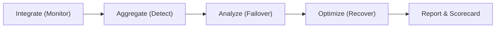

### 3. Distributed Resilience Topology
Strategically orchestrating standardized resilience across global cloud regions, diverse cloud providers, and multi-cloud targets, providing a unified institutional view of global resilience health and operational readiness.

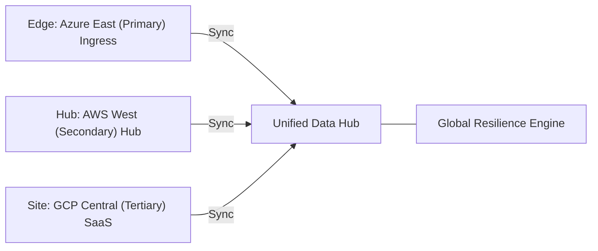

### 4. Resilience Hub & High-Trust Data Plane Protection Flow
Executing complex logic for securing the bridge between availability events and business continuity teams, ensuring every organizational identity is verified, failover-level privacy is maintained, and every resilience access is according to institutional standards.

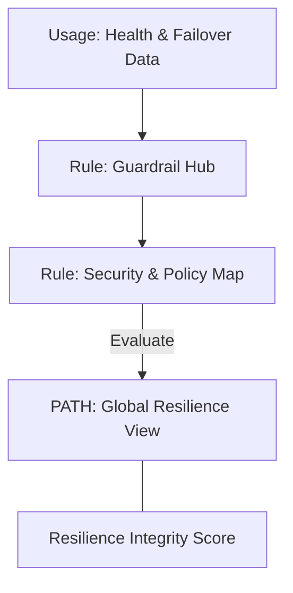

### 5. Multi-Cloud Resilience Federation & Governance Flow
Automatically managing unified resilience standards across global regions and diverse cloud tenants, ensuring institutional data residency and privacy boundaries by default.

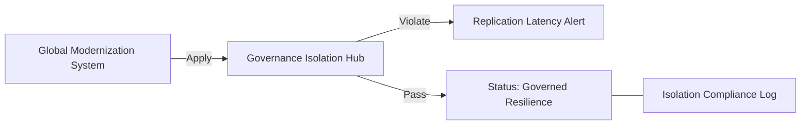

### 6. Encryption & Perimeter Protection Flow (Resilience Standard)
Managing the lifecycle of a resilience request, automatically enforcing institutional TLS 1.3 and resource encryption standards as required by security policy, ensuring zero-latency security confidence.

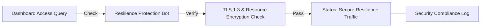

### 7. Institutional Resilience Maturity Scorecard
Grading organizational performance based on key indicators: Recovery Time Objective (RTO) Compliance, Recovery Point Objective (RPO) Compliance, and Drill Success Index.

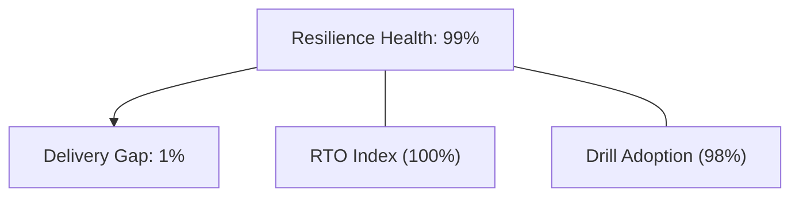

### 8. Identity & RBAC for Resilience Governance
Managing fine-grained access to resilience hubs, provisioning workers, and audit logs between CIOs, SRE Leads, and Business Continuity Managers.

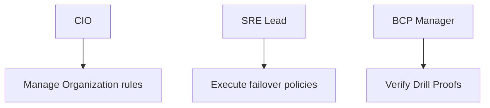

### 9. IaC Deployment: Cross-Cloud-DR-as-Code Framework
Using modular Terraform to deploy and manage the versioned distribution of the resilience tracking hubs, steering protection workers, and forensic metadata lakes.

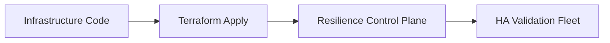

### 10. AIOps Resilience Drift & Risk Validation Flow
Using advanced analytics to identify sudden surges in replication lag, unauthorized runbook changes, suspicious configuration drifts, or unusual delivery pattern changes that could result in institutional risk or downtime.

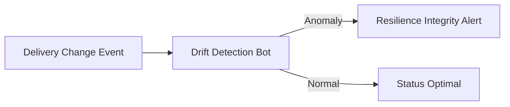

### 11. Metadata Lake for Forensic Resilience Audit
Storing long-term records of every resilience integration event (metadata), every drill executed, and every failover history for institutional record-keeping, compliance auditing, and post-provisioning forensics.

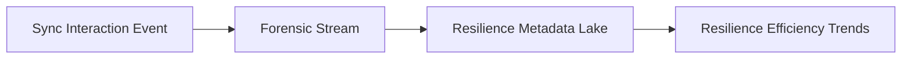

---

## 🏛️ Core Governance Pillars

1.  **Unified Foundation Coordination**: Maximizing resilience by centralizing all availability measurement through a single institutional plane.
2.  **Automated Failover Provisioning**: Eliminating "manual runbook" scenarios through proactive orchestration and pattern verification.
3.  **Sequential Resilience Intelligence**: Ensuring zero-interruption operations through dependency-aware resilience-driven data engineering.
4.  **Zero-Trust Identity Protection**: Automatically enforcing identity-based access, data-at-rest encryption, and policy evaluation across all resilience tiers.
5.  **Autonomous Operations Logic**: Guaranteeing reliability through automated industry-specific effectiveness monitoring runbooks.
6.  **Full Resilience Auditability**: Immutable recording of every runbook change and resilience provision for institutional forensics.

---

## 🛠️ Technical Stack & Implementation

### Resilience Engine & APIs
*   **Framework**: Python 3.11+ / FastAPI.
*   **Performance Engine**: Custom Python-based logic for multi-toolchain monitoring and DORA-style resilience metrics.
*   **Integrations**: Native connectors for Azure Traffic Manager, AWS Route53, and Global Load Balancers.
*   **Persistence**: PostgreSQL (Resilience Ledger) and Redis (Live Replication State).
*   **Auth Orchestrator**: Federated OIDC/SAML for least-privilege resilience management access.

### Governance Dashboard (UI)
*   **Framework**: React 18 / Vite.
*   **Theme**: Dark, Slate, Indigo (Modern high-fidelity productivity aesthetic).
*   **Visualization**: D3.js for delivery topologies and Recharts for availability velocity analytics.

### Infrastructure & DevOps
*   **Runtime**: AWS EKS or Azure Kubernetes Service (AKS) for management plane.
*   **Measurement Hub**: Managed event sourcing for immutable productivity timeline reconstruction.
*   **IaC**: Modular Terraform for deploying the resilience landing zone and validation fleet.

---

## 🏗️ IaC Mapping (Module Structure)

| Module | Purpose | Real Services |
| :--- | :--- | :--- |
| **`infrastructure/resilience_hub`** | Central management plane | EKS, PostgreSQL, Redis |
| **`infrastructure/enforcers`** | Distributed steering provisioners | Azure, AWS, GCP APIs |
| **`infrastructure/replication_pipes`** | Data Ingestion Hubs | Webhooks, Lambda |
| **`infrastructure/auditing`** | Forensic modernization sinks | S3, Athena, Quicksight |

---

## 🚀 Deployment Guide

### Local Principal Environment
```bash
# Clone the Cross-Cloud DR Patterns repository
git clone https://github.com/devopstrio/cross-cloud-dr-patterns.git
cd cross-cloud-dr-patterns

# Configure environment
cp .env.example .env

# Launch the Resilience stack
make init

# Trigger a mock resilience update and automated guardrail validation simulation
make simulate-dr
```

Access the Management Portal at `http://localhost:3000`.

---

## 📜 License
Distributed under the MIT License. See `LICENSE` for more information.

---
<div align="center">
  <p>© 2026 Devopstrio. All rights reserved.</p>
</div>
