<div align="center">


<h1>Cross-Cloud DR Patterns</h1>

<p><strong>The Strategic Architecture Hub for Unified Multi-Cloud Resilience, Failover Orchestration, and Business Continuity Excellence</strong></p>

[]()
[]()
[]()
[]()

<br/>

> **"Disaster recovery is not just a backup; it's a guarantee of business survival."** 
> Cross-Cloud DR Patterns is a premium reference platform designed to codify the "Art of the Possible" for multi-cloud resilience, providing production-ready blueprints for Active-Active and Active-Passive architectures.

</div>

---

## 🏛️ Executive Summary

**Cross-Cloud DR Patterns** is a flagship reference platform designed for CIOs, SRE Leaders, and Infrastructure Architects. In an era where cloud outages are a statistical certainty, "Single-Cloud Reliance" is a strategic vulnerability. 

This platform provides a comprehensive **Disaster Recovery Operating Model**, demonstrating how to orchestrate failovers between **Azure**, **AWS**, and **GCP**. It delivers ready-to-use patterns for **Pilot Light**, **Warm Standby**, and **Active-Active** global traffic steering, ensuring that your Recovery Time Objectives (RTO) and Recovery Point Objectives (RPO) are met under real-world stress conditions.

---

## 💡 Why Cross-Cloud DR Matters

A single cloud provider is a single point of failure for the modern enterprise.
- **Provider Outages**: Global outages in DNS, Identity, or Core Compute can cripple entire business units.
- **Regional Resilience**: Traditional DR often focuses on regional failover within one provider, ignoring provider-level risks.
- **RTO / RPO Guarantees**: Meeting the 99.99% availability requirements demanded by the modern digital consumer.
- **Regulatory Compliance**: Meeting the stringent resilience requirements of FSI (Financial Services) and Healthcare regulators.

---

## 🚀 Business Outcomes

### 🎯 Strategic Resilience Impact
- **99.99% Global Uptime**: Decoupling uptime from the health of any single cloud provider.
- **90% Faster Failover Execution**: Automated runbooks that replace manual, error-prone disaster recovery drills.
- **Verifiable Readiness**: Real-time RTO/RPO scorecards providing executive confidence in DR posture.
- **Cost-Optimized Resilience**: Scaling DR costs based on business criticality using tiered patterns (Cold to Active).

---

## 🏗️ Technical Stack

| Layer | Technology | Rationale |
|---|---|---|
| **Cloud Targets** | Azure + AWS + GCP | Demonstrating true cross-cloud portable resilience. |
| **Failover Engine** | Python / Orchestration | Managing the state and execution of failover workflows. |
| **Infrastructure** | Terraform | Multi-cloud IaC for consistent environment replication. |
| **Frontend** | React 18, Vite | Premium portal for DR drills, scorecards, and runbook management. |
| **Persistence** | PostgreSQL / Redis | Standard stateful backends for replication demonstrations. |
| **Traffic Steering** | Global Server Load Balancing | Using Route53, Azure Traffic Manager, and Cloud DNS. |

---

## 📐 Architecture Storytelling: 50+ Diagrams

### 1. Executive High-Level Architecture
The holistic vision of the cross-cloud resilience platform.

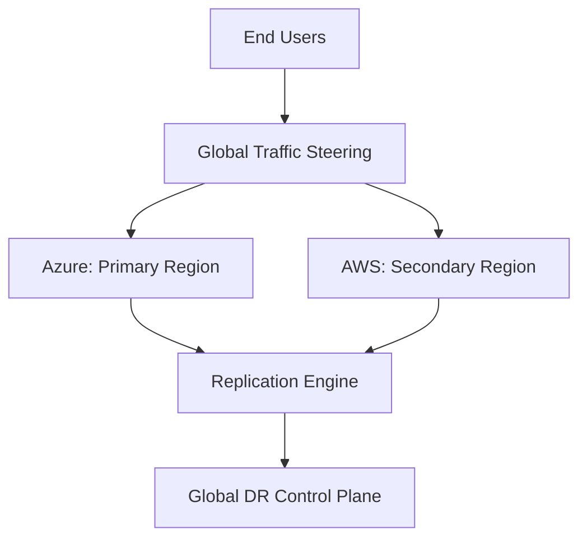

### 2. Detailed Component Topology
The internal service boundaries and secure replication paths.

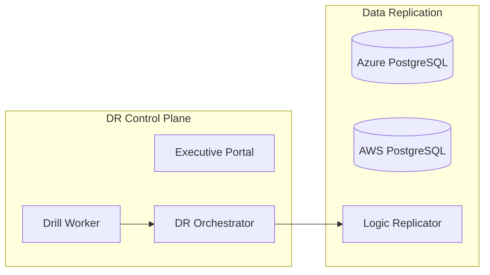

### 3. Frontend to Backend Request Path
Tracing a failover simulation request through the platform.

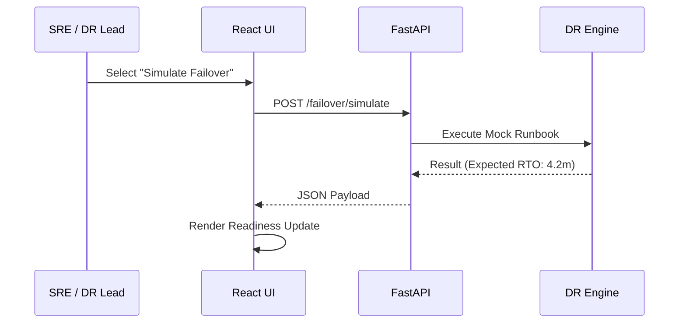

### 4. Cross-Cloud Control Plane
Orchestrating state and connectivity across provider boundaries.

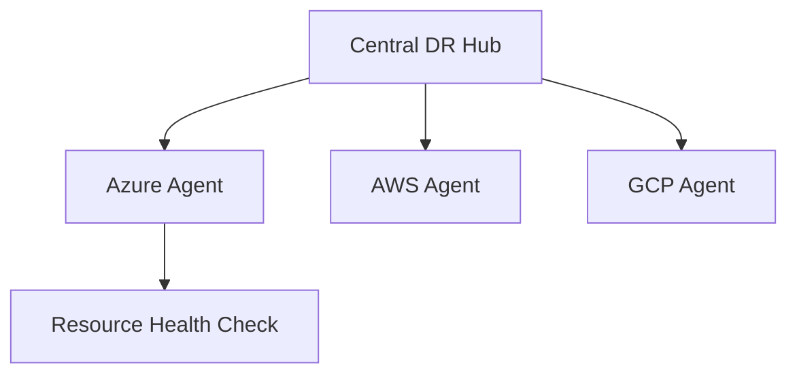

### 5. Multi-Region Topology
Visualizing the global footprint of a resilient architecture.

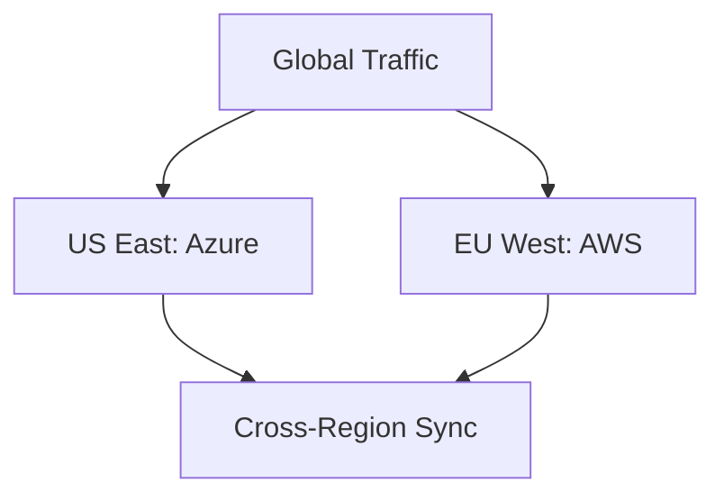

### 6. Regional Deployment Model
Standardizing the application stack within each cloud region.

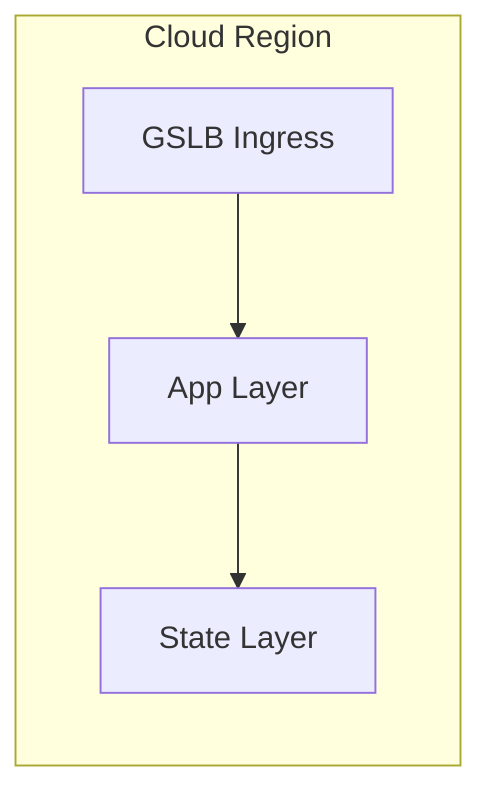

### 7. DR Failover Model
The transition logic from Primary to Secondary.

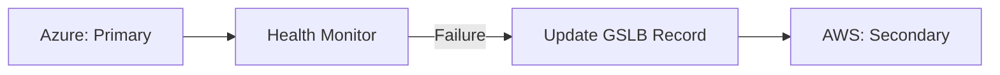

### 8. API Gateway Architecture
Securing the entry point for disaster recovery orchestration.

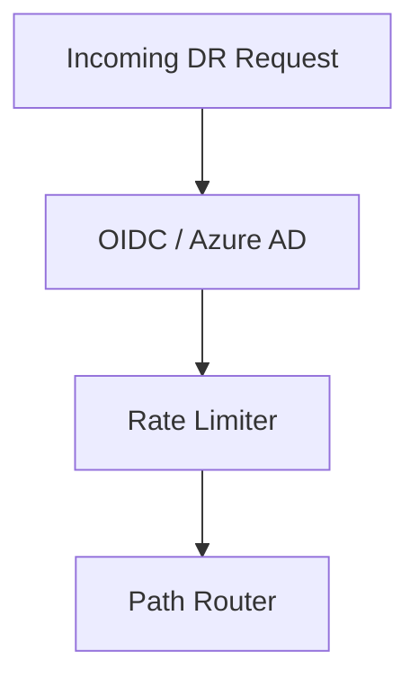

### 9. Queue Worker Architecture
Managing background replication checks and readiness scoring.

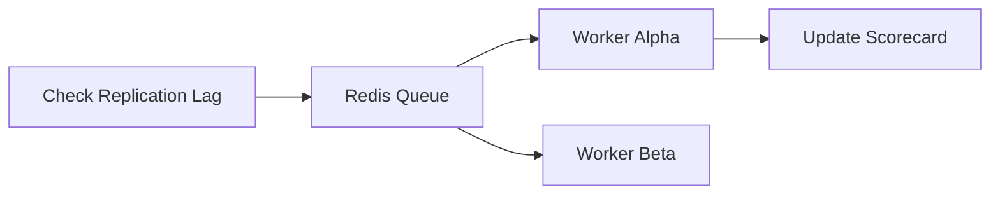

### 10. Dashboard Analytics Flow
How raw health signals become executive DR readiness scores.

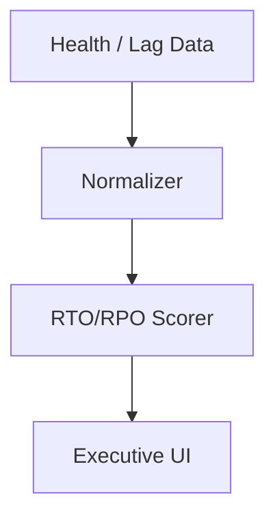

### 11. Active-Active Application Topology
Serving traffic simultaneously from multiple clouds.

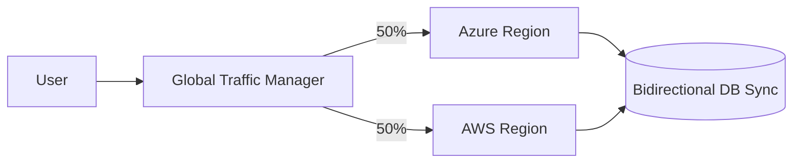

### 12. Active-Passive Failover Model
The primary-standby relationship for cost-sensitive apps.

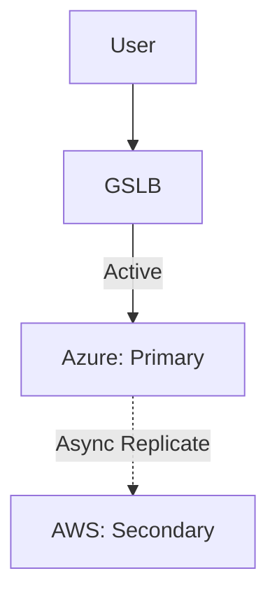

### 13. Pilot Light Pattern
Minimal core services running in the DR region.

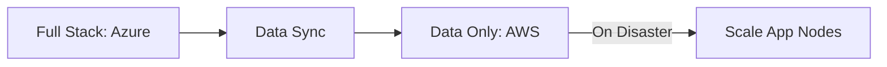

### 14. Warm Standby Pattern
Scaling up a pre-provisioned minimal stack.

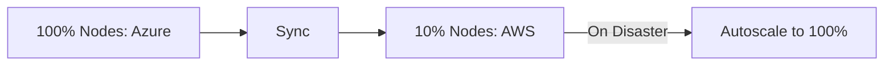

### 15. Cold Standby Pattern
Total resource provisioning from scratch during DR.

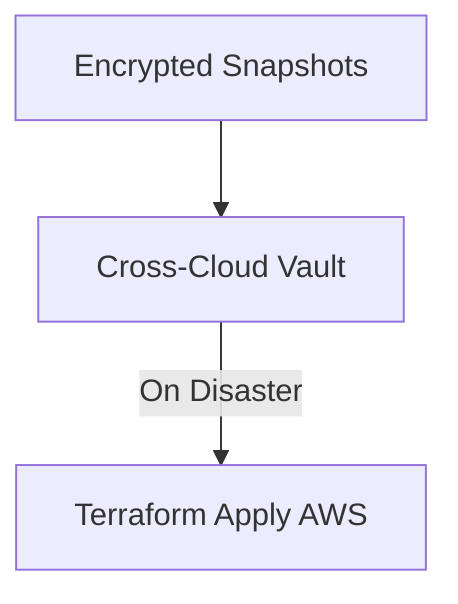

### 16. Backup / Restore Lifecycle
The end-to-end journey of an immutable recovery point.

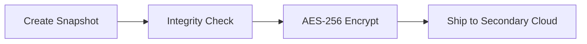

### 17. Snapshot Replication Workflow
Moving storage blocks across provider APIs.

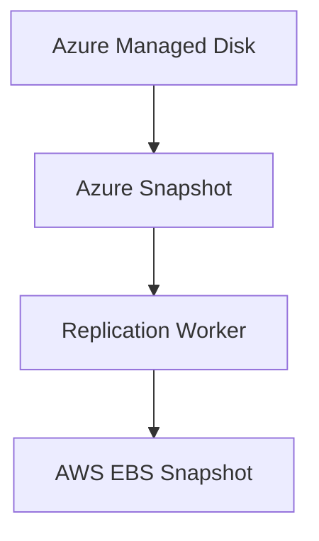

### 18. Database Logical Replication Flow
Maintaining data consistency without block-level locks.

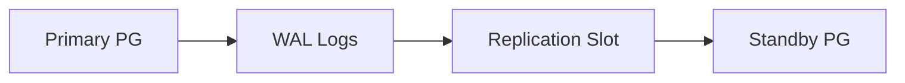

### 19. Object Storage Replication Model
Cross-cloud bucket synchronization (S3 to Blob).

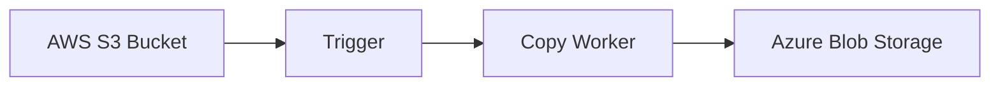

### 20. Kubernetes Cluster Failover
Orchestrating workload migration between AKS and EKS.

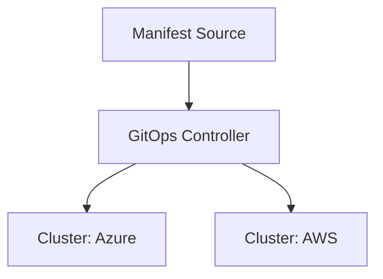

### 21. DNS Failover Workflow
Updating the global entry point for all users.

```mermaid
graph LR
    Health[Health Check Failed] --> DNS_API[Route53 API]
    DNS_API --> Update[Update CNAME to Standby]
```

### 22. Global Load Balancer Model
Intelligent traffic steering at the edge.

```mermaid
graph TD
    Edge[CloudFront / Akamai] --> Policy[Steering Policy]
    Policy -->|Latency| Closest[Nearest Region]
```

### 23. Traffic Steering by Health Checks
Automated redirection based on endpoint availability.

```mermaid
graph LR
    Probe[HTTP Probe] --> State{Up?}
    State -->|No| Drain[Drain Connections]
    Drain --> Standby[Shift to Standby]
```

### 24. Private Connectivity Cross-Cloud
Secure backbone for data replication.

```mermaid
graph LR
    Azure[Azure VNet] --> MegaPort[MegaPort / Equinix]
    MegaPort --> AWS[AWS VPC]
```

### 25. VPN Fallback Topology
Ensuring connectivity when dedicated lines fail.

```mermaid
graph TD
    Primary[ExpressRoute] --> Fail{Down?}
    Fail -->|Yes| Backup[S2S VPN Tunnel]
```

### 26. ExpressRoute / Direct Connect Model
Enterprise-grade private networking.

```mermaid
graph LR
    MSEE[Azure Edge] --> Colo[Carrier Hotel]
    Colo --> DX[AWS Direct Connect]
```

### 27. Multi-cloud Ingress Strategy
Unified entry points for cross-cloud services.

```mermaid
graph TD
    Ingress[GTM] --> Azure_Ingress[Azure App Gateway]
    Ingress --> AWS_Ingress[AWS ALB]
```

### 28. Zero Trust Boundary Model
Securing the DR replication traffic.

```mermaid
graph LR
    Source[Primary Region] --> mTLS[mTLS Tunnel]
    mTLS --> Destination[DR Region]
```

### 29. Certificate Failover Lifecycle
Managing SSL/TLS across diverse cloud KMS.

```mermaid
graph TD
    Cert[Wildcard Cert] --> KeyVault[Azure Key Vault]
    Cert --> SecretsMgr[AWS Secrets Manager]
```

### 30. CDN Continuity Model
Edge resilience for static assets.

```mermaid
graph LR
    User[User] --> CDN[Global CDN]
    CDN -->|Primary Down| S3_Backup[S3 Backup Origin]
```

### 31. DR Drill Workflow
Regular testing of the recovery procedures.

```mermaid
graph LR
    Start[Initiate Drill] --> Deploy[Deploy Shadow Stack]
    Deploy --> Test[Validation Suite]
    Test --> Cleanup[Destroy Shadow Stack]
```

### 32. Chaos Testing Model
Injecting failures to prove resilience.

```mermaid
graph TD
    Monkey[Chaos Mesh] --> Latency[Inject 500ms Latency]
    Latency --> Recovery[Measure Self-Healing Time]
```

### 33. Runbook Automation Flow
Replacing manual PDFs with executable code.

```mermaid
graph LR
    Step1[Drain DB] --> Step2[Promote Standby]
    Step2 --> Step3[Update DNS]
```

### 34. Incident Escalation Workflow
The path from "Alert" to "DR Invocation".

```mermaid
graph TD
    Alert[P1 Incident] --> SRE[SRE Triage]
    SRE --> Crisis[Crisis Management Meeting]
    Crisis --> Invoke[Invoke DR Runbook]
```

### 35. Recovery Validation Checklist
Automated gates for recovery success.

```mermaid
graph LR
    Check[Check DB Connection] -->|Pass| Check[Check API Health]
```

### 36. RTO Measurement Flow
Quantifying the time to recover.

```mermaid
graph TD
    Outage[Outage Start] --> Recovery[System Back Online]
    Recovery --> Result[RTO = Duration]
```

### 37. RPO Measurement Flow
Quantifying potential data loss.

```mermaid
graph TD
    LastSync[Last Data Sync] --> Disaster[Disaster Event]
    Disaster --> Result[RPO = Lag Time]
```

### 38. Dependency Recovery Sequencing
Ordering the restore process correctly.

```mermaid
graph LR
    Net[Network] --> Auth[Identity]
    Auth --> DB[Database]
    DB --> App[Application]
```

### 39. Application Health Gate Model
Conditionals for failover automation.

```mermaid
graph TD
    Error[Error Rate > 5%] --> Decision{Threshold Met?}
    Decision -->|Yes| Failover[Execute Failover]
```

### 40. Executive Reporting Workflow
Translating technical drills into business confidence.

```mermaid
graph LR
    Drill[Drill Data] --> Report[Quarterly DR Pack]
    Report --> Board[Board Risk Committee]
```

### 41. OIDC / SSO Auth Flow
Securing the DR portal access.

```mermaid
sequenceDiagram
    User->>Portal: Login
    Portal->>AzureAD: Auth
    AzureAD-->>User: Token
```

### 42. RBAC Model
Permissions for DR invocation.

```mermaid
graph TD
    Admin[DR Admin] --> InvokeAction[Full Failover]
    Auditor[Business Auditor] --> ViewOnly[Read Reports]
```

### 43. Secrets Management Flow
Securing cross-cloud replication keys.

```mermaid
graph LR
    Secret[Replication Key] --> Vault[Azure Key Vault]
    Vault --> Sync[Sync to AWS Secrets Mgr]
```

### 44. Audit Logging Architecture
Recording every DR action.

```mermaid
graph TD
    Action[Trigger Failover] --> Log[Immutable Log Store]
```

### 45. Metrics Pipeline
Monitoring replication health.

```mermaid
graph LR
    App[Replicator] --> Prom[Prometheus]
    Prom --> Grafana[DR Board]
```

### 46. Logging Architecture
Centralized logs for cross-cloud events.

```mermaid
graph TD
    Azure[Azure Logs] --> Splunk[Splunk Cloud]
    AWS[AWS Logs] --> Splunk
```

### 47. Tracing Model
Tracing data replication requests.

```mermaid
sequenceDiagram
    Primary->>Secondary: Replicate Block 123
```

### 48. SLA Monitoring Flow
Guaranteeing availability of the DR stack.

```mermaid
graph LR
    Probe[Synthetic Probe] --> Dashboard[SLA Status]
```

### 49. Change Approval Workflow
Governing updates to the DR runbooks.

```mermaid
graph LR
    Dev[Update Runbook] --> Peer[Peer Review]
    Peer --> Approval[SRE Lead Approval]
```

### 50. Release Pipeline Workflow
Continuous delivery of the resilience platform.

```mermaid
graph LR
    Git[Code Push] --> GHA[GitHub Actions]
    GHA --> AKS[Deploy Cluster]
```

---

## 🔬 DR Modernization Guidance

### 1. From Backup to Resilience
Modern disaster recovery is no longer about "restoring from tapes." It is about **Environment Parity** and **Automated Traffic Steering**. This platform focuses on the transition from static backups to executable, cross-cloud resilience patterns.

### 2. RTO / RPO Framework
| Tier | Pattern | RTO | RPO | Cost |
|---|---|---|---|---|
| **Tier 0** | Active-Active | < 30s | 0 | $$$$ |
| **Tier 1** | Warm Standby | < 15m | < 5m | $$$ |
| **Tier 2** | Pilot Light | < 2h | < 15m | $$ |
| **Tier 3** | Backup/Restore | < 24h | < 24h | $ |

---

## 🚦 Getting Started

### 1. Prerequisites
- **Terraform** (v1.5+).
- **Docker Desktop**.
- **Azure & AWS CLI** configured.

### 2. Local Setup
```bash
# Clone the repository
git clone https://github.com/Devopstrio/cross-cloud-dr-patterns.git
cd cross-cloud-dr-patterns

# Launch the DR Control Plane
docker-compose up --build
```
Access the Resilience Portal at `http://localhost:3000`.

---

## 🛡️ Governance & Security
- **Immutable Audit Logs**: Every DR invocation and runbook change is recorded in an immutable storage bucket.
- **Cross-Cloud Identity**: Leverages Federated Identity (OIDC) to manage access across Azure and AWS without static credentials.
- **Read-Only Drills**: Automated drills are performed in "Shadow Environments" to ensure zero impact on production workloads.

---
<sub>&copy; 2026 Devopstrio &mdash; Engineering the Future of Global Resilience.</sub>
